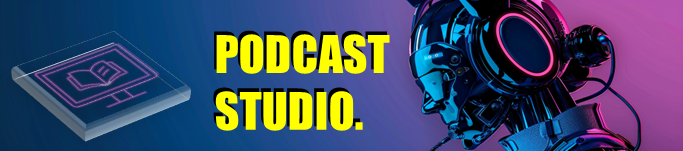

# Projeto Avatar Extremamente Aesthetic ;)

## 📒 Descrição

 > ℹ️ **NOTE:** Este é o repositório desenvolvido para a aula ministrada por [Falvojr](https://www.linkedin.com/in/falvojr/) na plataforma a [DIO](https://dio.me) em parceria com o [Santander Open Academy](https://www.linkedin.com/company/santander-open-academy/).

Projeto com o objetivo de gerar um Avatar da minha pessoa através de uma foto e fazer um video utilizando ferramentas de IA.

Utilizei uma esteira de prompts para gerar cada etapa do processo criativo.

## 🤖 Tecnologias Utilizadas
- [ChatGPT](https://chat.openai.com/) 
- [MidJourney](https://www.midjourney.com/app/)
- [D-ID](https://www.d-id.com/)

## 🧐 Processo de Criação
- 🤖 1. Crie os prompts de roteiro no [chatgpt](./src/prompts/chatgpt.md)
- 🤖 2. Use os prompts de roteiro gerados pelo chatgpt no [D-ID](https://www.d-id.com/)
- 🤖 3. Crie imagens com os prompts de artes no [midjourney](./src/prompts/midjourney.md)

## 🚀 Resultados

- Ao final gerou um video que estou aperfeiçoando e você pode ver uma [Preview]()

## 👨‍💻 Expert

    
    
&nbsp&nbsp&nbspHemerson Abreu 
    &nbsp&nbsp&nbsp
    <a href="https://github.com/azimutalx">
    GitHub</a>&nbsp;|&nbsp;
    <a href="https://www.linkedin.com/in/hemersonabreu/">LinkedIn</a>
&nbsp;|&nbsp;
    <a href="https://www.instagram.com/hemersonabreu/">
    Instagram</a>
&nbsp;|&nbsp;

  

---

⌨️ com 💜 por [Hemerson Abreu](https://github.com/azimutalx)